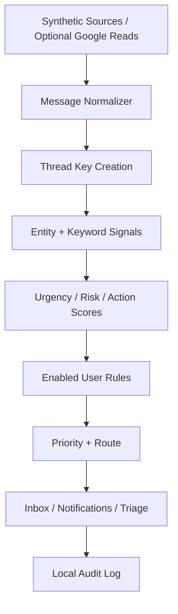

# OmniSignal Risk Radar

OmniSignal Risk Radar is a local-first deterministic risk-radar and command-center prototype. It normalizes synthetic messages into a unified inbox, applies explainable urgency/risk/action rules, and lets a user review in-app notifications and local tasks.

An optional Gmail and Google Calendar read-only connector foundation exists. It is disabled by default and tested with mocked provider responses only. This repository does not claim a successful live Google connection or sync.

## Release Status

- **V1.0:** synthetic multi-account risk-radar demo.
- **V1.1:** optional read-only Google connector foundation.
- **V1.1.1:** connector guard, token lifecycle, and reseed hardening.
- **V1.1.2:** account-safe cache deletion, labeled fixture evaluation, working deterministic user rules, and product-truth cleanup.
- **V1.2:** OmniSignal Command Center and daily briefings, planned.

## What Works

- Six synthetic accounts: personal Gmail, work Gmail, school Outlook, SMS, iMessage, and Calendar.
- 80 synthetic messages covering 11 repeated scenario templates.
- One normalized local inbox.
- Deterministic urgency, consequence-risk, and action-needed scoring.
- Weighted P0/P1/P2/P3 classification with explainable reasons.
- In-app notifications with snooze, dismiss, and resolve.
- Triage detail, local task creation, analytics, and a local audit trail.
- Basic thread-key creation.
- Enabled deterministic user rules for:
  - sender contains / equals
  - subject or body keyword matching
  - minimum priority
  - digest suppression
  - VIP treatment
- A simulated scheduling-review marker. It does not create a real queue or calendar action.
- Optional Google OAuth, token encryption/refresh, Gmail reads, and primary-calendar reads behind a disabled-by-default guard.

## What Does Not Work Yet

- No real email send or Gmail draft creation.
- No Calendar write, RSVP, availability coordination, or meeting booking.
- No autonomous AI secretary or paid-LLM chat.
- No production authentication, multi-user isolation, or SaaS deployment model.
- No Outlook/Microsoft Graph, real iMessage, Slack, Teams, or real SMS connector.
- No active cross-platform deduplication; the dedupe helper is not wired into ingestion.
- No real-world accuracy benchmark.
- No live Google account validation in this repository.

## Default Demo Mode

- `DEMO_MODE=true`
- `REAL_CONNECTORS_ENABLED=false`
- No paid APIs or hosted model subscriptions
- No real provider credentials required
- Synthetic data only
- SQLite local persistence
- In-app notifications only

Optional Google testing requires local credentials and an encryption key. Never commit them.

## Architecture



See [docs/ARCHITECTURE.md](docs/ARCHITECTURE.md).

## Screenshots

| View | Screenshot |
| --- | --- |
| Connections | [Synthetic accounts](docs/screenshots/connections.png) |
| Unified Inbox | [Normalized demo inbox](docs/screenshots/inbox.png) |
| Risk Radar | [Risk summary](docs/screenshots/radar.png) |
| Notifications | [In-app notifications](docs/screenshots/notifications.png) |
| Triage | [Explainable assessment](docs/screenshots/triage-security-alert.png) |
| Analytics | [Synthetic fixture conformance](docs/screenshots/analytics.png) |
| Audit Log | [Local traceability](docs/screenshots/audit-log.png) |
| Integrations | [Google connector disabled by default](docs/screenshots/integrations-google-disabled.png) |

## Run Locally

Backend:

```bash
cd backend
python -m pip install -r requirements.txt
uvicorn app.main:app --reload
```

Frontend:

```bash
cd frontend
npm install
npm run dev
```

Open <http://localhost:3000>.

Docker:

```bash
docker compose up --build
```

## Verification

```bash
make backend-test
make frontend-build
make audit
make eval
make smoke
```

Windows users without `make` can use [scripts/verify_frontend.md](scripts/verify_frontend.md) and:

```powershell
python scripts/verify_backend.py
python scripts/run_evaluation.py
python scripts/smoke_test.py
```

Release evidence is in [docs/evidence](docs/evidence/).

## Scoring and Rules

The baseline formula is:

```text
priority = round(urgency * 0.40 + risk * 0.35 + action * 0.25)
```

Safety overrides raise recognized security, finance, deadline, and scheduling-risk phrases. Enabled user rules then apply transparent sender/keyword preferences. Rules affect newly ingested or explicitly reanalyzed messages; they do not retroactively rewrite every stored assessment.

The engine is deterministic English keyword logic, not a learned model. It is not robust real-world language understanding.

## Evaluation Truth

The evaluation covers 80 labeled synthetic fixtures generated from 11 scenario templates. It reports:

- labeled fixture count
- ignored unlabeled count
- priority and route conformance
- P0 precision/recall inside the fixture set
- expected-reason recall
- scheduling-route and newsletter-suppression conformance

These are **synthetic fixture-conformance metrics**, not real-world accuracy. Unlabeled provider messages are excluded.

## Optional Google Connector

The Google foundation requests only:

- `gmail.readonly`
- `calendar.events.readonly`

Safety properties:

- disabled unless `REAL_CONNECTORS_ENABLED=true`
- tokens encrypted locally with Fernet
- token refresh before expiry
- no Gmail send/modify/delete
- no Calendar create/update/delete
- no attachment download
- disconnect and local-cache deletion

All provider tests use mocks. Full setup is documented in [docs/REAL_CONNECTOR_SETUP.md](docs/REAL_CONNECTOR_SETUP.md).

The current `create_all` schema lifecycle and production migration requirement are documented in [docs/MIGRATION_NOTES.md](docs/MIGRATION_NOTES.md).

## Demo Walkthrough

See [docs/DEMO_SCRIPT.md](docs/DEMO_SCRIPT.md). The scheduling action in V1.1.2 is explicitly simulated and does not book a meeting.

## Security and Privacy

- Demo mode uses fictional identities.
- `.env`, SQLite files, tokens, dependency directories, and build artifacts are ignored.
- Optional OAuth tokens are encrypted at rest.
- Real message content would still be local plaintext SQLite data; this is not production private-data handling.
- The application has no production authentication or tenant isolation.
- No outbound provider action exists.

See [docs/evidence/SECURITY_PRIVACY_NOTES.md](docs/evidence/SECURITY_PRIVACY_NOTES.md) and [docs/evidence/BRUTAL_PRODUCT_AUDIT.md](docs/evidence/BRUTAL_PRODUCT_AUDIT.md).

## Future Integrations

| Platform | Status |
| --- | --- |
| Gmail | Read-only foundation; live validation deferred |
| Google Calendar | Primary-calendar read-only foundation; live validation deferred |
| Outlook / Microsoft 365 | Not implemented |
| SMS | Synthetic only |
| iMessage | Synthetic only |
| Slack | Not implemented |
| Teams | Not implemented |

See [docs/ROADMAP.md](docs/ROADMAP.md).

## License

Released under the [MIT License](LICENSE).
