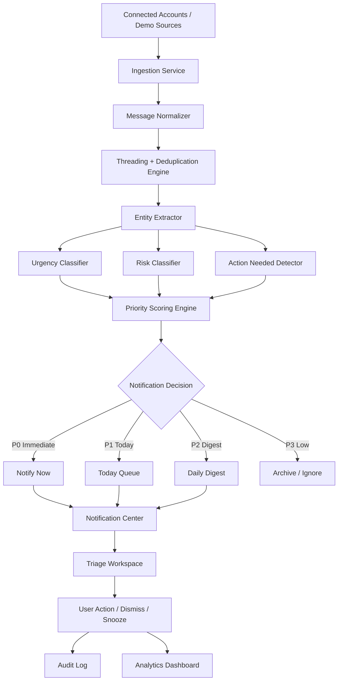

# OmniSignal Risk Radar

OmniSignal Risk Radar is a local-first, cross-platform message intelligence layer for AI secretary products. It ingests messages from multiple synthetic accounts, normalizes them into a unified inbox, detects urgency, consequence risk, and action-needed signals, then routes important items to notifications, human triage, or scheduling review.

The V1.0 demo is portfolio-ready, fully local, deterministic, explainable, and designed to operate without real inbox access or paid services.

## Demo Value

AI secretary products such as Howie are most useful when they protect the user's attention, not merely manage a calendar. OmniSignal demonstrates how an assistant can monitor many communication channels, surface a security alert or deadline before it is missed, suppress newsletter noise, and explain exactly why an interruption was created.

The demo shows a credible path from "assistant that reacts when asked" to "trusted attention layer that notices what matters."

## How This Extends SecretaryOps / TrustOps

SecretaryOps already covers scheduling, reminders, follow-ups, suggested replies, and human review. OmniSignal extends that operating model upstream:

- SecretaryOps receives normalized, prioritized messages instead of raw inbox noise.
- TrustOps receives ambiguous scheduling and calendar-conflict cases for safe human review.
- User actions such as snooze, resolve, task creation, and scheduling handoff are recorded in the audit log.
- Analytics and evaluation provide evidence that the system is catching urgent items without over-alerting.

OmniSignal is therefore a module inside the broader AI secretary system, not a separate inbox product.

## Zero-Budget Design

- No paid APIs or hosted model subscriptions.
- No OpenAI, Anthropic, Twilio, Slack, Teams, Gmail, or Microsoft Graph credentials.
- No connection to real inboxes, SMS accounts, calendars, or private messages.
- No outbound email, SMS, or push notifications.
- Synthetic demo data only.
- SQLite local persistence.
- Deterministic rules and explainable scoring.
- In-app notifications only.

## Architecture



See [docs/ARCHITECTURE.md](docs/ARCHITECTURE.md) for the complete system design.

## Features

- Six synthetic accounts: personal Gmail, work Gmail, school Outlook, SMS, iMessage, and calendar.
- 80 demo messages across scheduling, recruiting, interviews, security, finance, official deadlines, VIP follow-ups, conflicts, and newsletters.
- Connector registry and platform-independent normalized message model.
- Cross-platform threading and deterministic deduplication.
- Entity extraction for dates, times, money, deadlines, security events, payment events, document requests, and scheduling language.
- Separate 0-100 urgency, risk, and action-needed scores.
- Weighted P0/P1/P2/P3 priority classification with safety overrides.
- Explainable risk reasons attached to every assessment.
- In-app notification center with snooze, dismiss, and resolve actions.
- Unified inbox, Risk Radar, triage workspace, rules, analytics, and audit log.
- TrustOps scheduling-review handoff.
- Evaluation harness and automated backend tests.

## Screenshots

| View | Screenshot |
| --- | --- |
| Connections | [Six synthetic accounts](docs/screenshots/connections.png) |
| Unified Inbox | [Cross-platform inbox](docs/screenshots/inbox.png) |
| Risk Radar | [Executive risk dashboard](docs/screenshots/radar.png) |
| Notifications | [Priority notification center](docs/screenshots/notifications.png) |
| Triage | [Explainable message assessment](docs/screenshots/triage-security-alert.png) |
| Analytics | [Evaluation and distribution metrics](docs/screenshots/analytics.png) |
| Audit Log | [Decision traceability](docs/screenshots/audit-log.png) |

## Run Locally

### Backend

```bash
cd backend
python -m pip install -r requirements.txt
uvicorn app.main:app --reload
```

The API is available at `http://localhost:8000`, with interactive documentation at `http://localhost:8000/docs`.

### Frontend

In a second terminal:

```bash
cd frontend
npm install
npm run dev
```

Open `http://localhost:3000`.

### Docker

```bash
docker compose up --build
```

## Verification

From the repository root:

```bash
make backend-test
make frontend-build
make audit
make eval
make smoke
```

Windows users without `make` can use the commands in [scripts/verify_frontend.md](scripts/verify_frontend.md) and run:

```powershell
python scripts/verify_backend.py
python scripts/run_evaluation.py
python scripts/smoke_test.py
```

Release evidence is captured in [docs/evidence](docs/evidence/).

## Deterministic Scoring

The baseline score is:

```text
priority = round(urgency * 0.40 + risk * 0.35 + action * 0.25)
```

Safety overrides raise security incidents, likely card fraud, actionable same-day deadlines, near-term official document deadlines, scheduling ambiguity, and calendar conflicts to an appropriate minimum tier. Newsletter detection suppresses bulk-mail noise unless a genuine security, finance, or deadline signal is present.

## Demo Walkthrough

Use [docs/DEMO_SCRIPT.md](docs/DEMO_SCRIPT.md) for a guided product demonstration covering account connections, P0 filtering, security and interview alerts, TrustOps scheduling handoff, notification actions, audit evidence, and evaluation metrics.

## Security and Privacy

- `DEMO_MODE=true` by default.
- No secrets or real credentials are stored.
- Synthetic identities and account addresses are used throughout.
- SQLite stays local and is excluded from version control.
- No messages leave the application.
- Every system and user decision is auditable.

See [docs/evidence/SECURITY_PRIVACY_NOTES.md](docs/evidence/SECURITY_PRIVACY_NOTES.md).

## Future Integrations

| Platform | Future connector |
| --- | --- |
| Gmail | Gmail API OAuth |
| Outlook | Microsoft Graph API |
| SMS | User-approved phone sync or SMS provider |
| iMessage | Local macOS bridge, subject to Apple platform constraints |
| Slack | Slack App OAuth |
| Teams | Microsoft Graph / Teams APIs |
| Calendar | Google Calendar or Microsoft Calendar |

Real connectors remain disabled by default. See [docs/ROADMAP.md](docs/ROADMAP.md) for the V1.1 plan.

## License

Released under the [MIT License](LICENSE).
