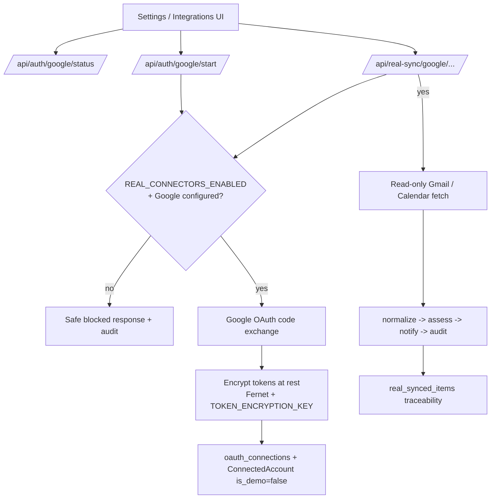

# OmniSignal Risk Radar Architecture

## System Overview

OmniSignal Risk Radar is a local-first deterministic prototype. Its implemented job is to transform synthetic communication events, plus optional unproven Google read-only inputs, into a ranked and explainable attention list.

The V1.0 system has four boundaries:

1. **Synthetic source boundary** - six demo accounts expose local fixture messages through connector adapters.
2. **Message intelligence boundary** - normalization, threading, entity extraction, scoring, and routing operate on platform-independent records.
3. **User workflow boundary** - the inbox, notification center, triage workspace, rules, analytics, and audit views expose decisions and user controls.
4. **Evidence boundary** - tests, evaluation fixtures, and audit records prove expected behavior on the synthetic dataset.

## Connector Architecture

All connectors implement the `BaseConnector` contract:

```python
class BaseConnector:
    platform: str

    def sync(self, account_id: str) -> list[dict]:
        raise NotImplementedError

    def normalize(self, raw_message: dict) -> dict:
        raise NotImplementedError
```

V1.0 adapters:

- `DemoGmailConnector`
- `DemoOutlookConnector`
- `DemoSmsConnector`
- `DemoIMessageConnector`
- `DemoCalendarConnector`

The adapters read local synthetic fixtures. A future OAuth connector may replace `sync()` without changing downstream scoring or UI contracts.

## Message Normalization Model

Platform-specific payloads become `UnifiedMessage` records containing:

- Connected account and platform
- Sender and recipient identifiers
- Subject and plain-text body
- Sent and received timestamps
- Attachment and read-state metadata
- Stable cross-platform thread key

The original fixture payload is retained separately in `RawMessage`. This separation preserves source evidence while giving every classifier one consistent input model.

Thread keys use canonicalized subjects and normalized participants. A similarity helper exists, but active cross-platform deduplication is not wired into ingestion.

## Scoring Pipeline

The entity extractor identifies structured clues such as dates, times, money, email addresses, URLs, deadlines, document requests, interviews, calendar events, security events, and payment events.

Three independent engines then score the message:

- **Urgency** - time pressure, imminent events, repeated follow-ups, and explicit urgency.
- **Consequence risk** - security, finance, legal, immigration, compliance, calendar, relationship, and suspicious-link signals.
- **Action needed** - confirmation, replies, calls, documents, scheduling, signatures, forms, payment updates, and account remediation.

The base priority formula is:

```text
priority = round(urgency * 0.40 + risk * 0.35 + action * 0.25)
```

The priority engine maps the result to:

- `P0_IMMEDIATE`
- `P1_TODAY`
- `P2_DIGEST`
- `P3_LOW`

Safety overrides raise known high-consequence cases, including security alerts, likely card fraud, actionable same-day deadlines, near-term official document deadlines, and risky scheduling conflicts. Newsletter detection caps interruption priority unless a genuine high-risk signal is present.

Every detected signal creates a `RiskReason` containing a reason code, reason type, point value, and human-readable explanation.

## Notification Routing

The notification router converts the final assessment into one route:

| Priority | Route |
| --- | --- |
| P0 | Notify now |
| P1 | Review today or scheduling review |
| P2 | Add to digest |
| P3 | Keep quiet in the unified inbox |

Notifications are in-app records only. Users can snooze, dismiss, or resolve them. Each mutation writes an audit event.

## Simulated Scheduling Review Marker

Scheduling messages are not auto-executed when the system detects:

- Time-zone ambiguity
- Location ambiguity
- Rescheduling
- Calendar conflict
- Other underspecified logistics

These messages receive `send_to_scheduling_review`. The current endpoint records a simulated scheduling-review marker and audit event only. There is no scheduling queue, parser workflow, reply, or external calendar action.

## Audit Logging

`AuditLog` records:

- Actor
- Action
- Target type and identifier
- Before state
- After state
- Timestamp

System scoring, demo synchronization, notification actions, task creation, safe-marking, and scheduling handoffs are traceable.

## Evaluation Harness

The synthetic dataset contains 80 messages with expected priority and routing labels. The evaluation service compares stored assessments against those labels and reports:

- Priority accuracy
- Action-routing accuracy
- P0 precision
- P0 recall
- Expected-reason recall
- Scheduling-routing accuracy
- Newsletter-suppression accuracy

Evaluation reads only payloads containing explicit synthetic `expected` labels and reports labeled and ignored-unlabeled counts. Expected reason codes are present for each fixture category, so reason recall has a real denominator. These metrics measure deterministic fixture conformance, not unobserved production inbox traffic.

## Data Storage

SQLite stores connected accounts, raw and normalized messages, threads, entities, assessments, reasons, notifications, action items, synchronization runs, rules, and audit events.

The database is local, reproducible from fixtures, and excluded from Git.

## V1.1 Real Connector Architecture (Read-Only, Opt-In)

V1.1 adds an opt-in read-only Google connector foundation alongside — not
replacing — the synthetic demo. It introduces a fifth boundary:

5. **Real provider boundary** - guarded OAuth and read-only sync against Google,
   isolated from synthetic data and disabled by default.

### Control flow and guard



### OAuth / token storage boundary

- `auth_google.py` handles status, start, callback, disconnect, and delete-cache.
- `real_connector_guard.py` enforces `REAL_CONNECTORS_ENABLED` and required config
  on every real endpoint; blocked attempts return a safe payload and are audited.
- `token_crypto.py` (Fernet) + `oauth_token_service.py` encrypt tokens at rest in
  the `encrypted_tokens` table. Plaintext tokens never touch the API surface or
  logs. `TOKEN_ENCRYPTION_KEY` is local-only and never committed.
- New tables: `oauth_connections`, `encrypted_tokens`, `real_sync_runs`,
  `provider_message_cursors`, and `real_synced_items`.

### Google read-only sync flow

- `google_gmail_connector.py` and `google_calendar_connector.py` depend on injected
  clients (mocked in tests) and only ever read. Gmail uses `gmail.readonly`;
  Calendar uses `calendar.events.readonly` over a safe window (next 14 days / past
  3 days). Bodies are truncated; attachments are never downloaded.
- `real_sync.py` pulls a small batch (≤25), then reuses the existing
  normalization, scoring, notification, entity, and audit pipeline via
  `real_ingestion_service.py`. Each run is recorded in `real_sync_runs` with
  provider cursors updated in `provider_message_cursors`.
- Real messages are tagged via a non-demo `ConnectedAccount` and surface in the
  unified inbox/radar with a **Real** badge.

### Data deletion / cache deletion flow

- **Disconnect** (`/disconnect/{id}`) deletes the connection's encrypted tokens
  and marks it disconnected. Synthetic data is untouched.
- **Delete cache** (`/delete-cache/{id}`) removes only the unified messages (and
  their assessments, reasons, entities, notifications, tasks, raw rows, and empty
  real threads) tracked for that connection in `real_synced_items`. Demo accounts
  and demo messages are never affected. Both actions write audit logs with counts.

## Future Real Integrations

Real integrations remain disabled by default.

## V1.1.1 Hardening Boundaries

- **Demo reseed isolation:** forced demo reseeding selects only demo accounts and
  their dependent rows. OAuth connections, encrypted tokens, provider cursors,
  real sync runs, and real synced items remain intact.
- **Token lifecycle:** OAuth callback expiry is stored in `expires_at`. Before a
  real sync, an expired or near-expiry access token is refreshed using the
  encrypted refresh token, then the replacement token is encrypted and
  persisted. Refresh failures mark both the connection and sync attempt.
- **Account-scoped identity:** Gmail message IDs, Gmail thread keys, Calendar
  event IDs, and external resource IDs include the connected account identifier.
- **OAuth state:** local-development state records contain creation and expiry
  timestamps, are single-use, and expire after ten minutes. Production requires
  durable server-side state shared across workers.
- **Configuration:** local `.env` loading never overrides process environment.
  Production configuration remains environment-driven.
- **Schema lifecycle:** `create_all` remains a local-demo convenience. See
  [MIGRATION_NOTES.md](MIGRATION_NOTES.md) for the production migration
  requirement.

## V1.1.2 Audit-Fix Boundaries

- Cache deletion considers only thread keys belonging to the selected OAuth
  connection and deletes a thread only when no message from any account still
  references it.
- Evaluation ignores unlabeled real-style provider data instead of treating it
  as a labeled benchmark.
- Enabled user rules are applied during ingestion and explicit reanalysis.
- Scheduling review remains a simulated marker, and active deduplication remains
  unimplemented.
- Live Google OAuth and provider sync remain unproven; tests use mocked provider
  responses.

| Platform | Planned integration boundary |
| --- | --- |
| Gmail | Gmail API OAuth connector |
| Outlook | Microsoft Graph mail connector |
| Calendar | Google Calendar and Microsoft Graph calendar connectors |
| Slack | Slack App OAuth connector |
| Teams | Microsoft Graph / Teams connector |
| SMS | User-approved phone synchronization or SMS provider |
| iMessage | Local macOS bridge subject to Apple constraints |

Production integration work must add consent, scoped OAuth, encryption, retention policy, revocation, rate limits, and provider-specific privacy controls before real messages are processed.
